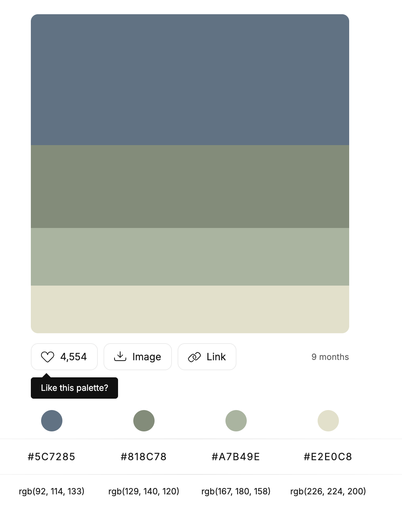
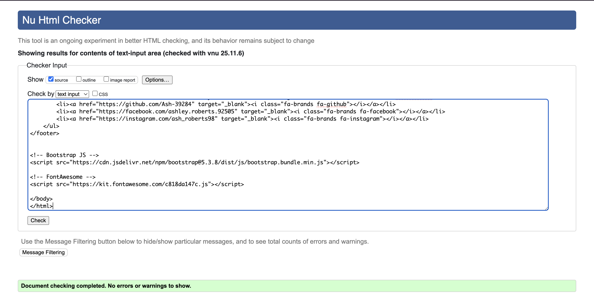
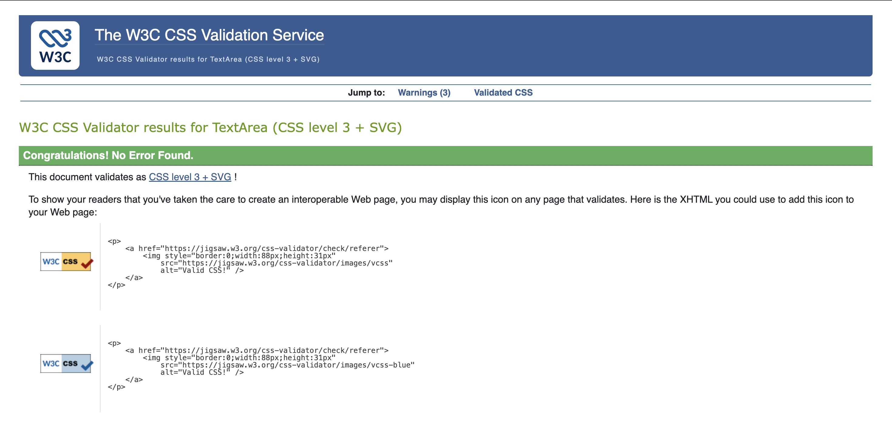
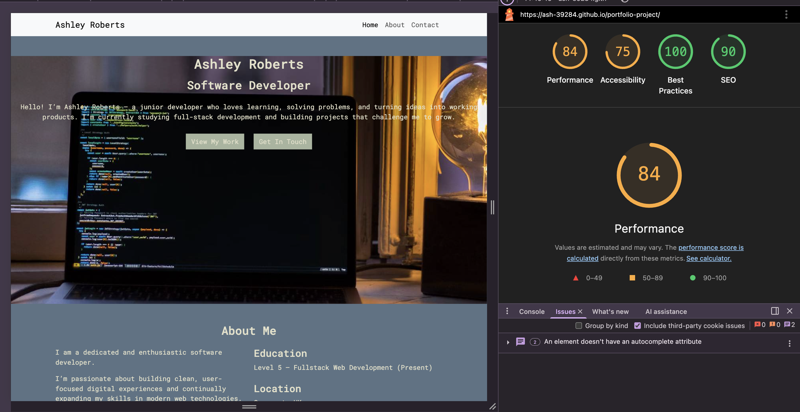

# Portfolio-Project

# Introduction

This portfolio site was created by Ashley Roberts. To display skills of HTML5, CSS3 and the Bootstrap framework. The motivation to build this project comes from being an aspiring software developer trying to get started within the tech industry. 

This website not only represents my foundtional skills as an aspiring developer it is a representation of dedication and a project that can and will only improve alongside my personal developement of skills, languages and experience. 

# Table of contents

1. [UX](#ux)

- [Project Goals](#project-goals)
- [Employers Goals](#employers-goals)
- [User Stories](#user-stories)
- [Developer and Business Goals](#develope-and-business-goals)
- [Design Choices](#design-choices)
- [Wireframes](#wireframes)

2. [Features](#features)

- [Existing Features](#existing-features)

- [Features to implement](#features-to-implement)

3. [Technoloies used](#technoloies-used)

4. [Testing](#testing)

5. [Deployment](#deployment)

- [How to run the project locally](#how-to-run-the-project-locally)

6. [Credits](#credits)

- [Content](#content)
- [Icons](#icons)
- [Code](#code)
- [Images](#images)
- [Video](#video)
- [Acknowledgements](#acknowledgements)

# **UX**

## **Project Goals**

The primary goal of this project is to display a clear introduction and professional background/ qualifications to potential employers.

## Employers Goals

The main target audience for this project is senior digital professionals who require individuals with specific software development skills.

## Goals:

* A clear easy site to read.
* Easy navigation of the site.
* A clear understanding of the individuals knowledge and current skillset.
* An easy way to contact.

This project will meet these needs because:

* The planning process considered an easy to read colour scheme to ensure readability. 
* The layout was carefully planned to ensure easy viewing. 
* The overall project is clear and professional allowing for easy reading and quick information. 
* The website ensures an easy and streamless way of contacting.

## Developer and Business Goals 

- To create a clean and clear design to professionaly represent information. 
- A professionally presented first example of using HTML, CSS and bootstrap technologies. 
- a projec thr developer is excited to represent and have as part of thier portfolio.

## User stories

As a potential employer I want:

- The ability to see the skills first hand of the devloper. 
- To be able to easily navigate throughout the site. 
- To be able to easily contact the project developer (as this is the main goal for the project development)
- To be able to quickly understand the professional background of the developer. 

# Design Choices

The design of the portfolio is a clear and professional layout. The follwong design choices was made with this in mind. 

## Fonts 

- The primary font used for this project is **Roboto Mono**. I used this as it's a clear font with little chance of it causing readability issues. It also looks great with emphasis applied such as the bold text for the headings.

## Icons

- All icons were used for the intented meaning and purpose. The logos have universal understanding.

## Colours 

- The primary pastel blue colour was chosen as the main colour because it contrasts well with the green colours used for the other elements. It was chosen to give a calm and friendly appeal to the webpage, whilst also giving the site a professional and sophisticated impression.

- The secondary green colours were chosen as it contrasts well with the blue background. whislt also giving options to use in different shades, for example; witht he buttons in the header section. The hover element takes the button to a darker green to highlight this action. Whilst it doesn't affect the readability of the text. This colour also allowewd for consistency across the project.

## Styling

- The text area's in the contact form were given curved edges to display a friendly and approachable way of contacting. Whilst not taking away from the professional look of the site. However the buttons in the header section were given sharp corners to show different abilities with styling, but not take away from the general consistency of the page with sharp and grid display layout. 

## Backgrounds

- The background was chosen to not include any images due to, wanting to make the website clear and simple to read. I think with adding background images to the majority of this site would distract the user from the important context. 

- The background colour was chosen to be a pastel blue becuase, it aligns well with the rest of the colour scheme which adss to the general professional look of the project.

## Header Image

- The header image was used to capture attention and to align with giving quick information from the start. The image clearly represents coding, programming and software development. Which aligns with the main goal of the website. To capture attention and disaply clear information.

## Video 

- The video on the form.html page was chosen to continue the ongoing theme of the context. Ensuring that the user understands that this is a representation of a software developer. 

- It was also chosen to display further skills of the developer. Aligning with the developer goals. 

# Wireframes

These wireframes were created using Figma during the scope plane aspect of the planning process. 

- [Desktop and phone screen wireframe](https://www.figma.com/design/6EsHblxY7NKnb1pO6zlTSa/portfolio-wireframe?node-id=0-1&p=f&t=Sad4aLwmFC9qHX10-0)

# Features

## Existing Features

### Forms

I created a basic form feature that will allow a user to easily send a message and contact the developer. Which aligns with the user stories.

### Image

An image was included within in the header section to add to the information included. This also breaks up the repetitiveness of the page and adds engagement for the user as they open the page.

### Video

I added a video feature in the form.html file to display further skills which aligns with the developer goals and user stories. The inclusion of this was also to ensure that the theme of the project was continued throughout the project. 

## Features to implement

### Bootstrap cards

I'd like to implement a project section that would include the [bootstrap cards](https://getbootstrap.com/docs/5.3/components/card/#example) to display each completed project.

##

# Technoloies used

- HTML

HTML5 was used within the index.html and form.html files within this project. I used this technology to apply content to my project.

- CSS

CSS3 was used within the style.css file within this project. I used this to style the project with colours, fonts and layout. I also used CSS to re-engineer some bootstrap elements and fontawesome icons to match the styling of my project.

- Bootstrap

Bootstrap v5.3 was used within the index.html and the form.html to implement elements such as the navbar, which was re-engnineered using HTML and CSS. I also used Bootstrap to implement the grid layout system througout the project. 

Recently, Bootstrap implemented classes to allow use of flexbox. I implemented some of this within the footer section of the from.html file. 

- Markdown

Markdown language was used within my README.md file. It was used to apply content and apply layout and structure to the file. 

# Testing

- [HTML code validator](https://validator.w3.org/nu/#textarea)

- [CSS code Validator](https://jigsaw.w3.org/css-validator/validator)

    The developer used w3c code to check the validity of the code. 

## Site loading times

When planning the project I was conscious on ensuring that the load times for this project were kept optimal. Especially with the inclusion of the video and the images. I used Lighthous in google dev tools to test this. The results are below. 

### Navigation

Throughout the development of this project. I ensured that all buttons and navigation bar elements were linked correctly adn wokring as intended. Below is a table showing all buttons and routes tested and confirmed to be wokring correctly. 

| Button | Destination | Working |
|--------|-------------|---------|
|Logo    |Top home page|   Yes   |
|Home    |Top home page|   Yes   |
|About   |About me section| Yes  |
|Contact |Contact section| Yes    |
|View my work|About me section|Yes|
|Get in touch|Contact section|Yes |
|Send    |form.html    |    Yes  |

### Bugs discovered:

- Solved bugs:-

- Responsivness issues for smaller screens:

The issue here was that the conent  within the display and contact section was not displaying how it was planned to on tablet and mobile devices. I used bootstraps grid method to manipulate the layout of the page. 

The issue was I wasn't implementing smaller breakpoints within the code correctly. 

- **About section, code fixes:**

Issue

`
`

Changed to:

`
`

Issue:

`
`

Changed to:

`
 `

- **Contact section, code fixes:**

Issue:

`
`

Changed to 

`
`

Issue:

`<form class="row g-3 col-6 col-sm-6 col-md-6 col-lg-6">`

Changed to:

`<form class="row g-3 col-12 col-md-6">`

- **Footer was not responsive on the form.html file. It wasn't staying at the bottom for smaller screens**

Issue: 

The issue was that I didn't set the viewport height to 100vh for the page. As I was using flexbox via bootstrap to layout th page. 

I fixed this by adding these classes to the body tag. 

`<body class="d-flex flex-column min-vh-100>`

- Textarea message box was the wrong size:

The issue here was that the message text input area was not displaying as the correct size. It was displaying past the screen size. 

The code causing this issue:

`<textarea class="form-label">`

This is the code that fixed this. 

`<textarea class="form-control" rows="5">`

# Deployment 

This project was built using VScode IDE. It was commited using Git and pushed to GitHub using the terminal to commit and push to the GitHub repository. 

To deploy this project to it's [GitHub repository](https://github.com/Ash-39284/portfolio-project). These following steps were taken.

1. Login to GitHb
2. From the list of repositories on the left side of the screen select **Ash-39284/portfolio-project**
3. From the menu bar at the top of the page. Selcet **settings**.
4. Scroll down and select **GitHub Pages**.
5. Under source, select the drop-down menu that says **none** and select **Master Branch**.
6. After selecting **Master Branch** the page should refresh automatically. If not, manually refresh. After a couple of moments the link to the deployed website should display on the top of this page. 

### How to run the project locally 

To clone this project you will need. 

1. A GitHub account. [Create a GitHub account here.](https://github.com/signup)
2. Open Google Chrome browser. 

To work on the project code within a local IDE (e.g. VScode) follow these steps:

1. Click this link the [GitHub Repository](https://github.com/Ash-39284/portfolio-project)
2. Click the green code drop down button and copy the https url. 
3. In your local IDE open the terminal. 
4. Change the current working directory to the location where you want the cloned directory to be made. 
5. Type 'git clone ' then paste the link you copied from step 2. 

# Credits

### Content

All text within the project is sourced by me.

The font style used throughout the project was sourced from [Google Fonts](https://fonts.google.com/specimen/Roboto).

The colour pallet was sourced from [Colour Hunt](https://colorhunt.co/palette/5c7285818c78a7b49ee2e0c8)

#### Icons

The icons useed in the footer were sourced from [FontAwesome](https://fontawesome.com/)

The Facebook logo was sourced from [here](https://fontawesome.com/icons/facebook?f=brands&s=solid). 

the Instagram logo was sourced [here](https://fontawesome.com/icons/instagram?f=brands&s=solid). 

the LinkedIn logo was sourced [here](https://fontawesome.com/icons/linkedin?f=brands&s=solid).

The GitHub logo was sourced [here](https://fontawesome.com/icons/github?f=brands&s=solid).

### Code

- The code for the navigation bar was taken from [Bootstrap](https://getbootstrap.com/docs/5.3/components/navbar/#supported-content)

- The code for the buttons in the header section was taken from [Bootstrap](https://getbootstrap.com/docs/5.3/components/buttons/#variants)

- The colour hex numbers were taken from [Colour Hunt](https://colorhunt.co/palette/5c7285818c78a7b49ee2e0c8)

## Images

The image in the header section was sourced from [unsplash](https://unsplash.com/). 

This image was sourced on [Unsplash](unsplash.com/photos/turned-on-gray-computer-cOkpTiJMGzA) created by Oskar Yildiz [Image screenshot reference](./assets/images/hero-photo-reference.png). 

## Video

The Video used in this project was sourced from [Pexels](https://www.pexels.com/).

This image was sourced from [Pexels](https://www.pexels.com/) created by Mikhail Nilov. [Video Link](https://www.pexels.com/video/a-man-looking-at-computer-monitor-6962343/). 

## Acknowledgements 

This project was coded and completed by Ashley Roberts (2025). 

